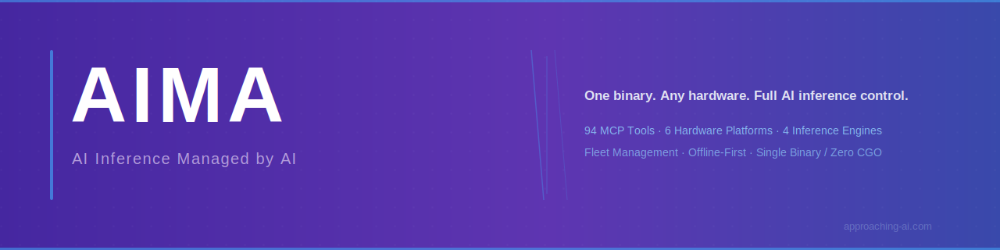
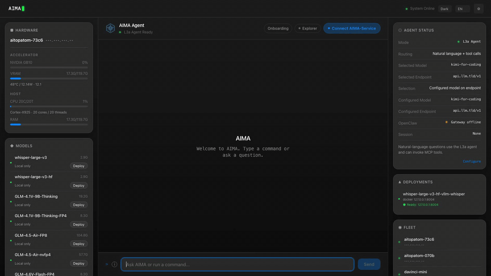
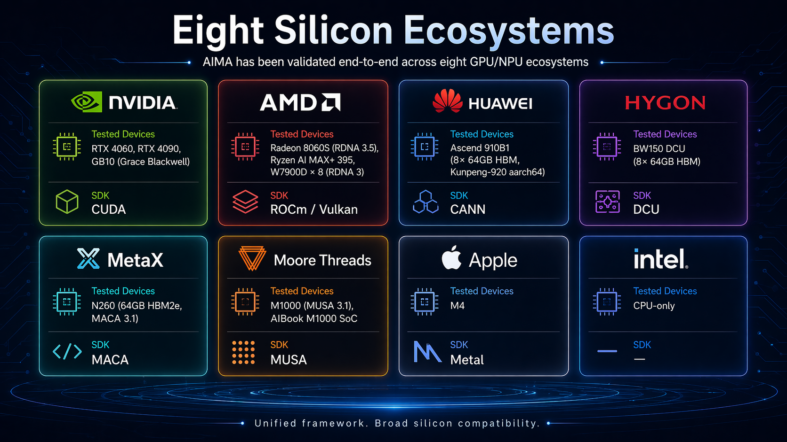
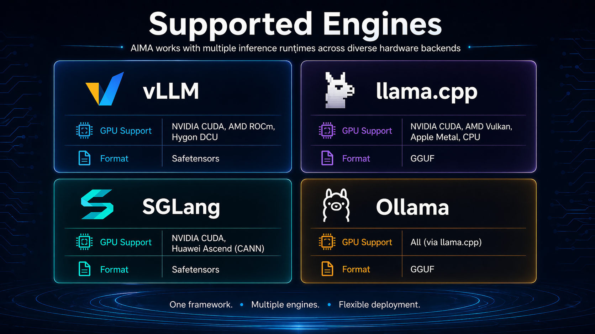
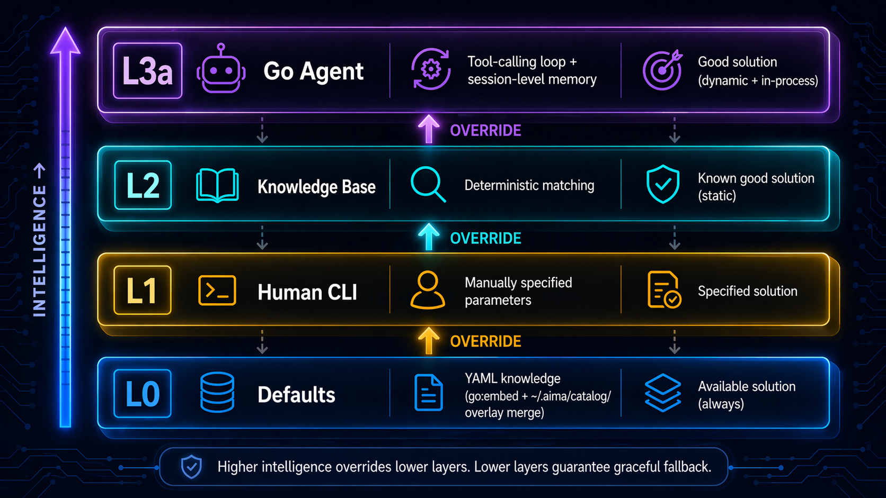

<!-- ======== Banner ======== -->
<div align="center">
  
</div>

<!-- ======== Bilingual switcher ======== -->
<div align="center">
  <a href="README.md"></a>
  <a href="README_zh.md"></a>
</div>

<!-- ======== Typing SVG (中文 · brand purple) ======== -->
<div align="center">
  
</div>

<!-- ======== Badge wall ======== -->
<div align="center">

[](https://github.com/Approaching-AI/AIMA/releases)
<!-- GitHub Stars badge — hidden until stars ≥ 500. Re-enable:
[](https://github.com/Approaching-AI/AIMA/stargazers) -->
[](LICENSE)
[](go.mod)
[](#60-秒创世)

</div>

---

**AI 算力，由 AI 管理** —— 一个 Go 单二进制,自动检测硬件、从 YAML 知识库解析最优配置、通过 K3S 部署推理引擎,并暴露 61 个 MCP 工具供 AI Agent 操控一切。

## 动态

- **2026-04** —— v0.4.0 发布:Explorer Agent Planner(PDCA)、Central Advisor + Analyzer、MCP 工具从 101 精简至 61、aima-service 设备身份 Phase 1、Onboarding 冷启动向导(五维 0–100 打分)、多模态 Benchmark(chat/TTS/ASR/T2I/T2V)。
- **2026-03** —— v0.3.x:OpenClaw 全栈集成、智能 Agent 路由、带 SGLang-KT 的 Engine Profile 体系、AMD RDNA3(W7900D)8 卡已验证。
- **2026-02** —— v0.2.0:Support 服务、Web UI 重构、OpenClaw 集成。
- **2026-01** —— v0.0.1:首个基础版本(硬件检测、多运行时)。

## 特性

- **零配置硬件检测** —— 自动发现 GPU(NVIDIA、AMD、华为昇腾、海光 DCU、Apple Silicon)、CPU 和内存。
- **知识驱动部署** —— YAML 目录包含硬件画像、引擎、模型和分区策略;无引擎特定代码分支。
- **多运行时** —— K3S(Pod)集群容器 + Docker(单机容器)+ Native(exec)裸机推理。
- **61 个 MCP 工具** —— AI Agent 可通过程序化接口完整控制硬件、模型、引擎、部署、集群等。
- **集群管理** —— 基于 mDNS 的局域网自动发现;跨异构设备远程工具执行。
- **离线优先** —— 所有核心功能零网络依赖;网络仅作增强。
- **单二进制,零 CGO** —— 可交叉编译到 Windows、macOS、Linux(amd64/arm64),无 C 依赖。

## 60 秒创世

### 下载

从 [Releases](https://github.com/Approaching-AI/AIMA/releases) 页面下载预编译二进制,或从源码构建:

```bash
git clone https://github.com/Approaching-AI/AIMA.git
cd AIMA
make build
```

对于已发布的产品版本,安装一行搞定:

```bash
curl -fsSL https://raw.githubusercontent.com/Approaching-AI/AIMA/master/install.sh | sh
```

Windows PowerShell 可用:

```powershell
irm https://raw.githubusercontent.com/Approaching-AI/AIMA/master/install.ps1 | iex
```

说明:
- 安装器会解析最新"可安装"的 `vX.Y.Z` 产品 release,而不是 GitHub 的 `latest` release,因为像 `bundle/stack/2026-02-26` 这种 bundle tag 不是主二进制发布。
- 如果最新 tag 还没上传主二进制资产,安装器会给出告警,并退回到最新可安装 release。
- Fork 仓库可通过 `AIMA_REPO=<owner>/<repo>` 覆盖下载源。
- 指定版本可用 `AIMA_VERSION=v0.2.0`。
- Windows 安装器当前面向 `windows/amd64`,默认安装到 `%LOCALAPPDATA%\Programs\AIMA`。

### 服务器部署(Linux)

```bash
# 1. 检测硬件
aima hal detect

# 2. 初始化基础设施(安装 K3S + HAMi + aima-serve 守护进程)
#    自动下载 airgap 离线镜像包,容器启动无需联网。
#    --tier k3s 在 docker 基础上叠加 K3S + HAMi。
#    需要 root 权限安装 systemd 服务。
sudo aima onboarding init --tier k3s --yes

# 3. 部署模型(自动匹配硬件和引擎)
aima deploy qwen3.5-35b-a3b
```

`aima onboarding init --tier k3s` 完成后,三个组件以 systemd 服务运行:

| 组件 | 作用 |
|------|------|
| K3S | 容器编排(containerd 就绪,airgap 镜像已预加载) |
| HAMi | GPU 虚拟化,支持多模型共享显存(不兼容硬件自动跳过) |
| aima-serve | API 服务监听 `0.0.0.0:6188`,mDNS 自动广播 |

服务器现在可以被局域网内的设备自动发现,随时接受推理请求。

### 客户端使用(任意平台)

在另一台设备上只需要 AIMA 二进制,不需要 `onboarding init` 或 `serve`:

```bash
# 通过 mDNS 自动发现局域网中的 AIMA 设备(无需 IP)
aima fleet devices

# 远程查询和操控
aima fleet exec <device-id> hardware.detect
aima fleet exec <device-id> deploy.list

# 直接调用 OpenAI 兼容 API
curl http://<服务器IP>:6188/v1/chat/completions \
  -H "Content-Type: application/json" \
  -d '{"model":"qwen3.5-35b-a3b","messages":[{"role":"user","content":"hello"}]}'
```

### Web UI

每个 AIMA 服务器内置 Web UI,访问 `http://<服务器IP>:6188/ui/`。

如何获取服务器 IP:运行 `aima fleet devices`。

如需 Fleet 全局仪表盘(自动发现局域网内所有节点),在自己的设备上运行 `aima serve --discover`,然后打开 `http://localhost:6188/ui/`。

<!-- ======== Web UI Demo GIF ======== -->
<div align="center">
  
</div>

### 安全

`aima onboarding init` 默认 **无认证启动**(局域网信任模型)。启用 API Key 认证:

```bash
# 设置 API Key(热更新,无需重启)
aima config set api_key <your-key>

# 之后所有 API/MCP/Fleet 请求都需要: Authorization: Bearer <your-key>
# Web UI 会自动弹出 Key 输入框。

# 远程 Fleet 命令带认证
aima fleet devices --api-key <your-key>
```

## 八大硅基生态

AIMA 已在八大 GPU/NPU 生态端到端验证 —— NVIDIA(CUDA)、AMD(ROCm / Vulkan)、华为昇腾(CANN)、海光(DCU)、沐曦(MACA)、摩尔线程(MUSA)、Apple(Metal)、Intel(CPU-only):

<div align="center">
  
</div>

## 支持引擎

AIMA 编排三大推理运行时 —— vLLM(Safetensors)、llama.cpp(GGUF)、SGLang(Safetensors) —— 跨所有支持的硬件后端:

<div align="center">
  
</div>

## L0→L3 智能阶梯

AIMA 通过攀登四层智能解析每一个部署决策。每一层都可以覆盖下一层,每一层失败时都优雅降级到下层。

<div align="center">
  
</div>

系统围绕四个不变量构建:引擎/模型类型无代码分支(YAML 驱动)、不管理容器生命周期(K3S 负责)、MCP 工具作为唯一真相源、离线优先。

完整架构文档见 [design/ARCHITECTURE.md](design/ARCHITECTURE.md)。

## 熔炉 —— 1200 次真机验证

每次 AIMA 发版都会走一遍熔炉 —— 一套端到端 UAT 矩阵,全部在真机上跑。

<div align="center">


</div>

- **八家厂商** × 多款设备(NVIDIA GB10 / RTX 4090、AMD W7900D × 8、华为 Ascend 910B × 8、海光 BW150 DCU × 8、沐曦 N260 × 2、摩尔线程 M1000、Apple M4、Intel CPU)
- 每个版本验证 **三种运行时**:K3S Pod、Docker 容器、Native exec
- 每轮 **16 个 UAT 项**:安装 / 硬件识别 / 模型部署 / API / MCP / 集群 / Onboarding 向导 / 故障转移
- 累计 **1200+ 证据文件**,全集群 ~1000 小时运行日志

每版本的 UAT 报告见 [`docs/uat/v0.4-release-uat.md`](docs/uat/v0.4-release-uat.md),逐设备原始证据(日志、配置、复现命令)在 [`artifacts/uat/v0.4/`](artifacts/uat/v0.4/) —— `u1`…`u15` 覆盖安装、硬件识别、模型部署、API/MCP、集群、Onboarding、故障转移,跑在 GB10、RTX 4090、AMD W7900D、Apple M4 等设备上。

## 原生 Agent 接入

AIMA 设计为 AI agent 优先驱动,人类其次。

- **61 个 MCP 工具** 暴露 hardware / model / engine / deploy / fleet / knowledge / agent / device 身份等 JSON-RPC 2.0 函数
- **Dispatcher** 通过 L0→L3 自动 fallback 路由任何请求 —— agent 无论本地 LLM 是否加载都得到相同 API
- **Explorer Agent Planner** 用 SQLite 后端工作区运行文档驱动的 PDCA 循环,每个决策留下结构化追踪

<details>
<summary><strong>按域浏览 MCP 工具集</strong></summary>

<br>

| 域 | 代表性工具 | 用途 |
|---|---|---|
| **hardware** | `hardware.detect` · `hardware.metrics` | GPU/CPU/RAM 库存 + 实时遥测 |
| **model** | `model.list` · `model.scan` · `model.pull` · `model.import` · `model.info` · `model.remove` | 本地模型目录 + 下载 + 导入 |
| **engine** | `engine.list` · `engine.pull` · `engine.scan` · `engine.import` · `engine.info` | 推理引擎生命周期 |
| **deploy** | `deploy.apply` · `deploy.dry_run` · `deploy.list` · `deploy.logs` · `deploy.delete` · `deploy.approve` · `deploy.status` | 启动 / 监控 / 停止模型服务 |
| **fleet** | `fleet.info` · `fleet.exec` | 局域网自动发现 + 远程工具执行 |
| **knowledge** | `knowledge.resolve` · `knowledge.search` · `knowledge.promote` · `knowledge.evaluate` · `knowledge.save` · `knowledge.analytics` | YAML 目录 + 黄金配置生命周期 |
| **agent** | `agent.ask` · `agent.status` · `agent.rollback` | L3a Agent 调用 + 决策追踪 |
| **device** | `device.register` · `device.status` · `device.renew` · `device.reset` | aima-service 设备身份生命周期 |
| **benchmark** | `benchmark.run` · `benchmark.matrix` · `benchmark.record` · `benchmark.list` | 可复现性能测试 |
| **central** | `central.advise` · `central.scenario` · `central.sync` | 中心知识服务器 + 推荐反馈 |
| **system** | `system.config` · `system.status` | 配置热更新 + 整体健康 |

完整工具注册参见 [`internal/mcp/`](internal/mcp/)。

</details>

接入任何兼容 MCP 的客户端(Claude Desktop、Cursor、自定义 agent),AIMA 即成为你的 AI 推理控制平面。

## 项目结构

```
cmd/aima/          入口与按领域拆分的依赖装配
internal/
  hal/             硬件检测
  knowledge/       YAML 知识库 + SQLite 解析器
  runtime/         K3S(Pod)+ Docker(容器)+ Native(exec)运行时
  mcp/             MCP 服务端 + 61 个工具注册/实现
  agent/           Go Agent 循环(L3a)
  cli/             Cobra CLI(MCP 工具的薄包装)
  ui/              内嵌 Web UI(Alpine.js SPA)
  proxy/           OpenAI 兼容 HTTP 代理
  fleet/           mDNS 集群发现 + 远程执行
  sqlite.go        SQLite 状态存储(`package state`,modernc.org/sqlite,零 CGO)
  model/           模型扫描/下载/导入 + 元数据识别
  engine/          引擎镜像管理
  stack/           K3S + HAMi 基础设施安装器
catalog/
  hardware/        硬件画像 YAML
  engines/         引擎资产 YAML
  models/          模型资产 YAML
  partitions/      分区策略 YAML
  stack/           栈组件 YAML
```

## 构建

### 本机构建

```bash
make build
# 输出: build/aima(Windows 上为 build/aima.exe)
```

### 交叉编译所有平台

```bash
make all
# 输出:
#   build/aima.exe          (windows/amd64)
#   build/aima-darwin-arm64 (macOS/arm64)
#   build/aima-linux-arm64  (linux/arm64)
#   build/aima-linux-amd64  (linux/amd64)
```

### 打包 GitHub Release 资产

```bash
make release-assets
# 输出:
#   build/release/<version>/aima-darwin-arm64
#   build/release/<version>/aima-linux-amd64
#   build/release/<version>/aima-linux-arm64
#   build/release/<version>/aima-windows-amd64.exe
#   build/release/<version>/checksums.txt
```

如本地装了 `gh`,可继续上传到对应的 GitHub release:

```bash
make publish-release-assets
```

推送 `v0.2.1` 这类带注释的 SemVer tag 时,也会自动触发 `.github/workflows/release.yml`,构建并上传同一套资产。

### 运行测试

```bash
go test ./...
```

## 许可证

Apache License 2.0。详见 [LICENSE](LICENSE)。
